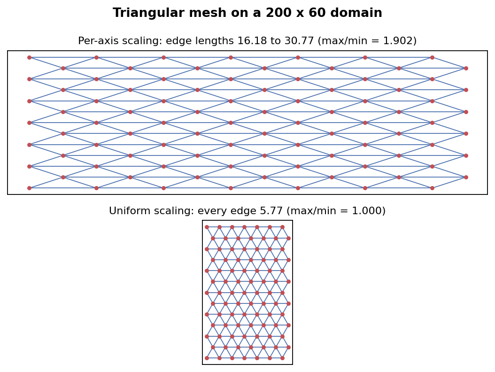

# Flexible Graph Construction for Neural Weather Prediction

**Google Summer of Code 2026 - final report**

| | |
| :--- | :--- |
| **Contributor** | Prajwal Hawaldar ([@prajwal-tech07](https://github.com/prajwal-tech07)) |
| **Organisation** | [MLLAM](https://github.com/mllam) |
| **Project** | [Flexible Graph Construction](https://summerofcode.withgoogle.com/programs/2026/projects/1GFUKY85) (350 hours) |
| **Mentors** | Hauke Schulz, Leif Denby, Joel Oskarsson |
| **Repositories** | [weather-model-graphs](https://github.com/mllam/weather-model-graphs), [neural-lam](https://github.com/mllam/neural-lam) |

---

## Summary

Graph-based weather models learn on a mesh. Before this project, the tooling that
builds those meshes assumed the mesh was a regular rectangular lattice, and that
assumption was hardcoded in enough places that no other topology could be used
without rewriting the pipeline.

The goal was to make mesh construction topology-agnostic across the two
repositories that MLLAM maintains: `weather-model-graphs`, which builds and
stores graphs, and `neural-lam`, which trains models on them.

I opened **9 pull requests and 15 issues** across both repos. Three PRs are merged
and shipped, five are open and under review, and the work splits into four
strands: separating mesh geometry from mesh connectivity, connecting the two
repositories so they share one graph format, adding automated performance
regression checking to CI, and migrating `neural-lam` onto PyTorch Geometric's
`HeteroData`.

Most of it began as a written design proposal rather than as code. I opened the
architecture issues, argued for an API, revised it in discussion with the
maintainers, and started implementing once the design was agreed. The section
[below](#designing-before-building) traces that path from issue to merged PR.

### Contributions

| PR | Repo | What it does | Status |
| :--- | :--- | :--- | :--- |
| [#81](https://github.com/mllam/weather-model-graphs/pull/81) | wmg | `mesh_layout` argument, two-step coordinate/connectivity split | **Merged**, in v0.4.0 |
| [#123](https://github.com/mllam/weather-model-graphs/pull/123) | wmg | `to_torch_tensors_on_disk`, writes the shared graph format | **Merged**, in v0.4.0 |
| [#147](https://github.com/mllam/weather-model-graphs/pull/147) | wmg | Benchmark regression check in CI | **Merged** 2026-08-17 |
| [#596](https://github.com/mllam/neural-lam/pull/596) | neural-lam | `create_graph_with_wmg` CLI, replaces the duplicated builder | Open, approved feedback addressed |
| [#92](https://github.com/mllam/weather-model-graphs/pull/92) | wmg | `mesh_layout="triangular"` | Open, in review |
| [#91](https://github.com/mllam/weather-model-graphs/pull/91) | wmg | `mesh_layout="prebuilt"` for user-supplied meshes | Open |
| [#711](https://github.com/mllam/neural-lam/pull/711) | neural-lam | Load flat graphs into `pyg.HeteroData` | Open, changes requested |
| [#713](https://github.com/mllam/neural-lam/pull/713) | neural-lam | Hierarchical graphs in `HeteroData` | Open, stacked on #711 |

Issues opened along the way include
[#144](https://github.com/mllam/weather-model-graphs/issues/144) (CI benchmarking),
[#149](https://github.com/mllam/weather-model-graphs/issues/149) (dependency floor),
[#661](https://github.com/mllam/neural-lam/issues/661) and
[#714](https://github.com/mllam/neural-lam/issues/714).

---

## The problem

`neural-lam` uses an encode-process-decode architecture. Grid points carrying the
weather state are encoded onto a coarser mesh (`g2m`), message passing happens on
the mesh (`m2m`), and the result is decoded back to the grid (`m2g`). The mesh is
the thing the model actually computes on, so how you build it matters.

Two problems sat underneath this.

First, `weather-model-graphs` built mesh coordinates and mesh connectivity in the
same step. You could not ask for "the same connectivity rules, but on a different
node layout", because the layout was not a separate concept.

Second, `neural-lam` had its own graph builder, `neural_lam/create_graph.py`, 963
lines long, duplicating logic that already existed in `weather-model-graphs`. It
called `networkx.grid_2d_graph` in two places, so a rectangular mesh was not a
default that could be changed, it was an assumption baked into the file. Any
irregular or non-rectangular data source was blocked by it, and every improvement
to graph construction had to be made twice.

---

## Designing before building

The architecture in this project was not handed to me as a specification. I
proposed it, and the proposals came before the code.

| Proposed | Issue | Became |
| :--- | :--- | :--- |
| 2026-02-25 | [wmg#68](https://github.com/mllam/weather-model-graphs/issues/68) grid-node area weights | open |
| 2026-02-26 | [wmg#69](https://github.com/mllam/weather-model-graphs/issues/69) logic bug in CRS handling | fixed, closed |
| 2026-02-26 | [wmg#71](https://github.com/mllam/weather-model-graphs/issues/71) decouple topology from connectivity | revised into #78 |
| 2026-03-01 | [wmg#78](https://github.com/mllam/weather-model-graphs/issues/78) introduce `mesh_layout` | [PR #81](https://github.com/mllam/weather-model-graphs/pull/81), merged |
| 2026-03-01 | [wmg#80](https://github.com/mllam/weather-model-graphs/issues/80) triangular layout | [PR #92](https://github.com/mllam/weather-model-graphs/pull/92) |
| 2026-03-01 | [wmg#79](https://github.com/mllam/weather-model-graphs/issues/79) prebuilt layout | [PR #91](https://github.com/mllam/weather-model-graphs/pull/91) |
| 2026-06-26 | [wmg#144](https://github.com/mllam/weather-model-graphs/issues/144) CI benchmark regression | [PR #147](https://github.com/mllam/weather-model-graphs/pull/147), merged |

The `mesh_layout` design is the clearest example of the pattern, and also of the
fact that the first version was not the right one. I opened
[#71](https://github.com/mllam/weather-model-graphs/issues/71) in February
arguing that mesh topology and mesh connectivity should be separated. It was
closed, because the design needed reworking, and I reopened the argument in a
tighter form as [#78](https://github.com/mllam/weather-model-graphs/issues/78).

What followed was a long design discussion covering the call signatures for all
three graph archetypes, what belonged in `mesh_layout_kwargs` against
`m2m_connectivity_kwargs`, and how coordinate creation should pass its implied
adjacency knowledge downstream so the connectivity step does not have to rederive
it. Several of my own suggestions were corrected in that thread. The API we
converged on there is, with small changes, the one that shipped in v0.4.0.
[PR #81](https://github.com/mllam/weather-model-graphs/pull/81) was opened the day
after that agreement.

The same shape repeats elsewhere. The CI benchmark check began as
[#144](https://github.com/mllam/weather-model-graphs/issues/144), a written
argument for same-runner A/B measurement, and was implemented only after the
approach was agreed. The dependency and specification issues
([#149](https://github.com/mllam/weather-model-graphs/issues/149),
[neural-lam#714](https://github.com/mllam/neural-lam/issues/714)) came out of
questions raised during review of my own PRs.

The practical effect is that by the time I wrote code, the hard decisions had
already been argued out in public, and review was about implementation rather than
about direction.

---

## Separating layout from connectivity

[PR #81](https://github.com/mllam/weather-model-graphs/pull/81) introduced a
`mesh_layout` argument and split mesh construction into two independent steps:

1. **Coordinate creation** decides where mesh nodes go.
2. **Connectivity creation** decides which nodes are joined, given those positions.

Each layout is a module exposing the same interface, so adding a new topology
means adding one file rather than touching the pipeline. Connectivity code no
longer knows or cares how the coordinates were produced.

This is the piece everything else stands on. It shipped in v0.4.0 and both the
triangular ([#92](https://github.com/mllam/weather-model-graphs/pull/92)) and
prebuilt ([#91](https://github.com/mllam/weather-model-graphs/pull/91)) layouts
are built on top of it.

---

## One graph format, two repositories

With layout pluggable, the next problem was that the two repositories could not
exchange graphs.

[PR #123](https://github.com/mllam/weather-model-graphs/pull/123) added
`wmg.save.to_torch_tensors_on_disk`, which writes a graph in the on-disk tensor
format `neural-lam` reads, following the graph storage specification the
community agreed on. It shipped in v0.4.0 (released 2026-07-28).

[PR #596](https://github.com/mllam/neural-lam/pull/596) is the other half:
a `create_graph_with_wmg` CLI that builds a graph from a datastore using
`weather-model-graphs` and writes it out in that format, replacing the 963-line
duplicate with **215 lines**. The old entry point still works and emits a
deprecation warning.

This PR took the longest to get right, and most of that was review rather than
code. Working through it produced several things worth recording:

- The estimator for grid node distance is `sqrt(x_range * y_range / N)`. Because
  `np.ptp` measures `n-1` intervals across `n` points, it is biased low by
  `sqrt((nx-1)(ny-1) / (nx * ny))`: about 0.2% at 500x500, but 10% at 10x10.
- Terminology was inconsistent between "spacing", "distance" and "resolution".
  We standardised on "distance", to match `weather-model-graphs`. That surfaced a
  genuine bug: `mesh_node_distance = grid_distance * ratio` means the ratio is
  mesh-to-grid, but the argument was named grid-to-mesh, the wrong way round. It
  was renamed before the CLI ever shipped in a release, so no deprecation path
  was needed.
- On my mentor's suggestion the hand-written assertions in the tests were removed
  in favour of the shared graph validator. Before deleting a check that had come
  from another contributor's PR, I corrupted a valid graph six different ways and
  confirmed the validator caught each one. It also turned out the manual check
  pinned edge features to exactly 3 dimensions, while the specification allows 3
  or 4, so removing it fixed a latent disagreement with the spec.

---

## Keeping performance honest

Graph construction is the slow part of the pipeline, and nothing was watching it
for regressions. I opened
[issue #144](https://github.com/mllam/weather-model-graphs/issues/144) proposing a
CI check, and implemented it in
[PR #147](https://github.com/mllam/weather-model-graphs/pull/147), merged on
2026-08-17.

The design question was how to measure a slowdown on shared CI runners, where
absolute timings are meaningless because hardware varies between jobs. The answer
was to stop comparing against recorded numbers:

- Run the benchmark for the PR and for its base branch **back to back in the same
  job on the same runner**, so both sides see the same hardware and the noise
  largely cancels.
- Swap **only the library** between the two runs, keeping the benchmark harness
  fixed at the PR's version. Checking out the base branch would swap the harness
  too, and you would be measuring with two different rulers.
- Compare **relative percentages**, not seconds, and post the result as a sticky
  PR comment.

The check is informational rather than blocking, and reports peak memory
alongside runtime. The threshold is deliberately set very low (0.1%) so that it
can be raised against real observed noise rather than guessed at up front.

Phase 2, currently in progress, replaces the single timing sample with the median
of repeated runs. Comparing identical code back to back still shows around 1%
variation, so a median is needed before the threshold means much.

---

## Making triangular meshes actually equilateral

A triangular mesh is worth having because each interior node has 6 equidistant
neighbours instead of 8 neighbours at two different distances, which makes
message passing more isotropic. That argument only holds if the triangles really
are equilateral.

They were not. `networkx.triangular_lattice_graph` produces a unit-edge lattice,
but the lattice was then scaled to fill the domain **independently in x and y**.
Stretching one axis more than the other turns equilateral triangles into
isosceles ones, and the distortion depends on the shape of the domain:

| Domain | Longest/shortest edge, per-axis scaling | After the fix |
| :--- | ---: | ---: |
| 100 x 100 | 1.357 | 1.000000 |
| 200 x 60 | 1.902 | 1.000000 |
| 60 x 200 | 1.874 | 1.000000 |

Even on a square domain the longest edge was 36% longer than the shortest. On a
wide domain it was nearly double, so the "equidistant neighbours" property the
layout exists to provide was simply not there.



The fix is to scale by a **single factor in both directions**. Two behaviours
follow, depending on which arguments you give:

- With `mesh_node_spacing`, the edge length *is* the requested spacing, and the
  node counts are chosen to cover the domain. The outermost nodes may sit
  slightly outside it.
- With `nx`/`ny`, the counts are fixed and the lattice is scaled to the largest
  size that still fits inside the domain, so edge length follows from the counts.
  This is the case shown in the lower panel above, which is why it does not fill
  the frame.

Both panels are drawn with `ax.set_aspect(1)`. Without it the axes distort the
picture independently of the mathematics, and the two cases cannot be compared
honestly. The figure is reproducible with `python figures/make_figures.py`, which
needs only `networkx`, `numpy` and `matplotlib`.

### The bug underneath the bug

Fixing the scaling exposed a second, quieter problem.

Multiscale graphs are built by generating several lattices at different
resolutions and merging them. The merge works **by coincident position**: a
coarse node and a fine node at the same coordinates become one node, and that is
what ties the levels together.

Because each level was scaled independently to fit the domain, coarse nodes
almost never landed exactly on fine ones. Nothing merged. `flat_multiscale` with
a triangular layout returned **three disconnected components, one per level**,
instead of a single connected multiscale graph. No test caught this, because the
tests checked node and edge counts, and the counts were all correct. The graph
was the right size and the wrong shape.

Anchoring every level to a shared origin, with per-level spacing derived from a
common base, fixed it. Coincident nodes went from 0 to the expected count and the
component count went from 3 to 1. The regression test now asserts connectivity
directly:

```python
def test_flat_multiscale_is_connected(self, xy_large):
    """Regression: independently scaled levels never merged, leaving one
    disconnected component per level instead of a multiscale graph."""
    components = wmg.create.create_all_graph_components(
        coords=xy_large,
        mesh_layout="triangular",
        mesh_layout_kwargs=dict(mesh_node_spacing=2.0),
        m2m_connectivity="flat_multiscale",
        ...
    )
    assert nx.number_weakly_connected_components(components["m2m"]) == 1
```

---

## Migrating to HeteroData

`neural-lam` represents a loaded graph as a dictionary of 11 keys. PyTorch
Geometric's `HeteroData` is a better fit: it is built for graphs with several node
and edge types, which is exactly what a grid/mesh graph is.

[PR #711](https://github.com/mllam/neural-lam/pull/711) loads flat graphs into
`HeteroData` and wires it into `BaseGraphModel`;
[#713](https://github.com/mllam/neural-lam/pull/713) extends it to hierarchical
graphs. Both are open with CI green.

A review from [@Sir-Sloth-The-Lazy](https://github.com/Sir-Sloth-The-Lazy) on #711
found two real bugs I had initially argued were not bugs, and was right on both
counts: the feature flag was unreachable from several
model classes, and storing a `HeteroData` object via `setattr` escapes
`nn.Module._apply`, so the graph stayed on the CPU after `.cuda()`. Both are
fixed, the second by rebuilding the view on access rather than storing it.

My mentor has since asked for a more ambitious version: drop the dual code path
entirely, remove the graph dictionary from `neural-lam` altogether, and hold graph
state in a dedicated module instead of assigning attributes onto the model. That
is the current state of this strand, and it is the main piece of unfinished work.

---

## Where things stand

**Merged and shipped:** the two-step mesh layout architecture (#81), the shared
graph writer (#123), and the CI benchmark regression check (#147). The first two
are in the released v0.4.0.

**Open and close:** #596 has all review feedback addressed, CI green, and is
waiting on final approval. #92 has an equilateral-triangle fix pushed and two
small review points outstanding.

**Open and further out:** #91 (prebuilt meshes), and the `HeteroData` migration in
#711 and #713, which needs reworking toward the HeteroData-only design.

**Picked up by someone next:** Phase 2 of #144 (median of repeated benchmark
runs), the `--mesh_layout` CLI flag in
[#661](https://github.com/mllam/neural-lam/issues/661), which is written and
waiting for #596 to land, and relaxing the `torch-geometric` floor
([#149](https://github.com/mllam/weather-model-graphs/issues/149)).

Not reached: the stretch work in the proposal on graph quality metrics,
density-adaptive meshes and adaptive mesh refinement. The layout abstraction from
#81 is the hook those would attach to.

---

## What I learned

**Measure before claiming.** The most useful sentences I wrote in review were the
ones a mentor could reproduce. When asked whether a removed test was safe to
delete, "the validator covers it" is an opinion; corrupting a graph six ways and
showing the validator catches each is an answer.

**Tests that check size do not check shape.** The disconnected-components bug
survived a full test suite because every count was correct. The graph had the
right number of nodes and edges and the wrong topology entirely.

**A fix that is pushed is not a fix that is communicated.** I pushed the
equilateral-triangle fix hours before a meeting where the same problem came up
from a stale notebook. The code was already right. I had not said so, which meant
it may as well not have been.

**Reviewers repeat themselves for a reason.** When a mentor writes "I still
think", the previous answer did not land. Reading that as a signal rather than as
a repetition saved a round trip more than once.

**Designing in the open is a separate skill from writing the code.** This is the
part of the project I came in weakest at and improved at most. Writing
[#78](https://github.com/mllam/weather-model-graphs/issues/78) forced me to say
what the boundary between two concepts actually was, in a form other people could
disagree with, before I had any implementation to hide behind. My first attempt at
that argument was closed and needed rewriting. The discussion that followed
changed the design again, several times, and the result was better than what I
proposed.

I started this project able to implement a design and finished it able to propose
one, defend it, and be argued out of the parts that were wrong. Working on a
codebase that real forecasting work depends on is what taught me the difference
between code that runs and code that other people can build on.

---

## Acknowledgements

Thanks to **Leif Denby** for detailed and patient review across both repositories
throughout the summer, and to **Hauke Schulz** and **Joel Oskarsson** for
mentorship and design discussion. Thanks also to the wider MLLAM community for
reviews and for the surrounding work this project depended on.

---

*Every figure and number in this report can be regenerated from this repository:
`python figures/make_figures.py`.*
